# ⚡ C++ Quantitative Engine

> High-performance backtesting engine processing **3 Million bars/second**

---

## 📋 Overview

This is the **execution layer** of the Hybrid Quant System. It takes strategy parameters developed in Python and runs them at C++ speed for production-grade backtesting.

### Key Features
- **Event-Driven Architecture**: Deterministic bar-by-bar simulation
- **Zero Look-Ahead Bias**: Orders fill at **next bar's open** (realistic slippage model)
- **Modular Design**: Easily swap strategies, indicators, and risk modules
- **Benchmarked**: Processes 712K 1-minute bars in <250ms

---

## 🏗️ Architecture

```mermaid
flowchart TD
    subgraph DataLayer["📊 Data Layer"]
        CSV["CSV File"] --> MDM["MarketDataManager"]
        MDM --> BARS[("Bar Vector")]
    end
    
    subgraph IndicatorLayer["📐 Indicator Layer"]
        BARS --> SMA["SMA"]
        BARS --> EMA["EMA"]
        BARS --> RSI["RSI"]
        BARS --> BB["Bollinger Bands"]
        BARS --> ROC["Rate of Change"]
    end
    
    subgraph StrategyLayer["🧠 Strategy Layer"]
        SMA & EMA & RSI & BB & ROC --> REGIME["RegimeStrategy"]
        REGIME --> |"LV_TREND\nHV_TREND"| MOM["MomentumStrategy"]
        REGIME --> |"LV_RANGE"| MR["MeanReversionStrategy"]
        REGIME --> |"HV_RANGE"| FLAT["No Signal"]
    end
    
    subgraph ExecutionLayer["⚙️ Execution Layer"]
        MOM & MR --> RISK["RiskManager"]
        RISK --> |"Approved"| EXEC["ExecutionEngine"]
        EXEC --> |"Fill @ Open"| PNL["Trade P&L"]
    end
    
    PNL --> REPORT["📈 Performance Report"]
```



---

## 📁 File Structure

```
Engine/
├── include/                    # Header-only implementation
│   ├── Bar.hpp                 # OHLCV data structure
│   ├── CircularBuffer.hpp      # O(1) rolling window
│   ├── Indicators.hpp          # SMA, EMA, RSI, BB, ATR
│   ├── Strategies.hpp          # Regime, Momentum, MeanReversion
│   ├── ExecutionEngine.hpp     # Order fills & trade tracking
│   ├── RiskManager.hpp         # Stop-loss, daily limits
│   ├── MarketDataManager.hpp   # CSV parsing
│   └── Engine.hpp              # Main orchestrator
├── src/
│   └── main.cpp                # Entry point
├── CMakeLists.txt              # Build configuration
└── README.md                   # You are here
```

---

## 🔧 Core Components

### 1. CircularBuffer (`CircularBuffer.hpp`)
A lock-free, fixed-size ring buffer for O(1) rolling calculations.

```cpp
// Example: 20-period rolling window
CircularBuffer<double, 20> buffer;
buffer.push(100.5);  // O(1) insert
double oldest = buffer.front();  // O(1) access
```

**Why it matters**: Traditional `std::vector` would require O(n) shifts. This enables millions of indicator updates per second.

---

### 2. Indicators (`Indicators.hpp`)
All technical indicators use the `CircularBuffer` for streaming updates:

| Indicator | Class | Update Complexity |
|-----------|-------|-------------------|
| Simple Moving Average | `SimpleMovingAverage` | O(1) |
| Exponential Moving Average | `ExponentialMovingAverage` | O(1) |
| Relative Strength Index | `RSI` | O(1) |
| Bollinger Bands | `BollingerBands` | O(1) |
| Rate of Change | `RateOfChange` | O(1) |
| Rolling Statistics | `RollingStats` | O(1) |

---

### 3. Strategies (`Strategies.hpp`)
Polymorphic strategy interface for clean extensibility:

```cpp
class Strategy {
public:
    virtual void on_bar(const Bar& bar) = 0;  // Update state
    virtual int signal() const = 0;            // -1, 0, +1
    virtual std::string name() const = 0;
};
```

**Implemented Strategies:**
- `RegimeStrategy`: Detects market volatility/trend state
- `MomentumStrategy`: Trend-following with RSI/Volume filters
- `MeanReversionStrategy`: Bollinger Band fades in ranging markets

---

### 4. ExecutionEngine (`ExecutionEngine.hpp`)
Simulates realistic order execution:

```cpp
// Order submitted on Bar N
engine.submit_order(1, 100);  // Buy 100 shares

// Fill happens on Bar N+1 at OPEN price
engine.on_bar_open(next_bar);  // Fills at next_bar.open
```

**Key Realism Features:**
- No same-bar fills (prevents look-ahead bias)
- Fee model: 0.05% per trade (configurable)
- Trade tracking for P&L attribution

---

### 5. RiskManager (`RiskManager.hpp`)
Prevents overtrading and enforces risk limits:

| Parameter | Default | Description |
|-----------|---------|-------------|
| `max_position_pct` | 2.0 | Max position as % of capital |
| `stop_loss_atr` | 0.10 | Stop-loss as ATR multiple |
| `max_trades_per_day` | 20 | Daily trade limit |
| `cooldown_bars` | 5 | Bars between trades |

---

## ⚙️ Build Instructions

### Requirements
- C++20 compatible compiler
- CMake 3.15+
- Windows: Visual Studio 2019+ with C++ workload
- Linux/Mac: GCC 10+ or Clang 12+

### Compile (Release)

```bash
mkdir build && cd build
cmake .. -DCMAKE_BUILD_TYPE=Release
cmake --build . --config Release
```

### Compiler Flags (Auto-applied)
| Platform | Flags |
|----------|-------|
| MSVC | `/O2 /arch:AVX2 /W4 /permissive-` |
| GCC/Clang | `-O3 -march=native -Wall -Wextra` |

---

## 🚀 Usage

```bash
./bin/Release/QuantEngineApp "path/to/data.csv"
```

### CSV Format
```csv
timestamp,open,high,low,close,volume
2015-01-01 09:15:00,250.5,251.0,250.0,250.8,10000
```

### Sample Output
```
[BENCHMARK] Processed 712036 bars in 245.457 ms (2900858 bars/sec)

==========================================
          PERFORMANCE REPORT              
==========================================
Final Equity:   112824.42
Total Return:   12.82%
------------------------------------------
Total Trades:   11642
Win Rate:       40.98%
Profit Factor:  1.05
==========================================
```

---

## 📊 Performance Breakdown

| Stage | Time (712K bars) |
|-------|------------------|
| CSV Parsing | ~50ms |
| Indicator Calculation | ~100ms |
| Strategy Logic | ~50ms |
| Execution Simulation | ~45ms |
| **Total** | **~245ms** |

---

## 🧪 Extending the Engine

### Adding a New Strategy

```cpp
class MyStrategy : public Strategy {
public:
    void on_bar(const Bar& bar) override {
        // Update your indicators
        my_indicator_.update(bar.close);
        
        // Set signal
        if (my_indicator_.value() > threshold_) {
            current_signal_ = 1;  // Buy
        }
    }
    
    int signal() const override { return current_signal_; }
    std::string name() const override { return "MyStrategy"; }
    
private:
    SomeIndicator my_indicator_;
    int current_signal_ = 0;
};
```

### Adding a New Indicator

```cpp
class MyIndicator {
public:
    MyIndicator(int period) : buffer_(period), period_(period) {}
    
    double update(double value) {
        buffer_.push(value);
        if (!buffer_.is_full()) return 0.0;
        
        // Your calculation here
        return calculate();
    }
    
private:
    CircularBuffer<double> buffer_;
    int period_;
};
```

---

## 📄 License

MIT License - See root `LICENSE` file.
