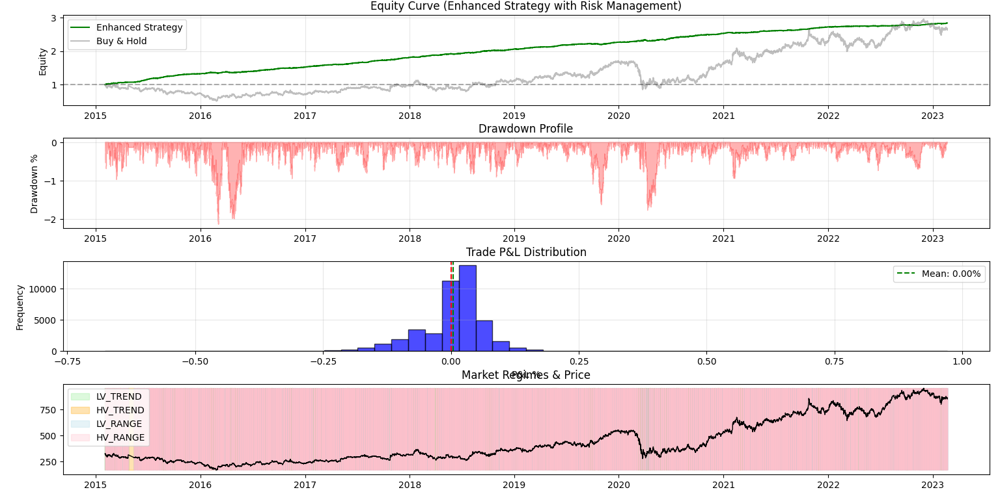
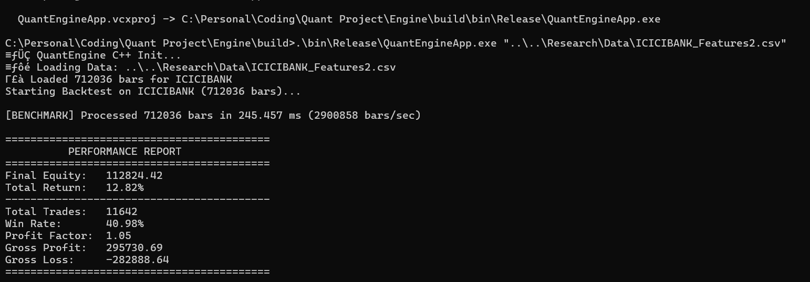
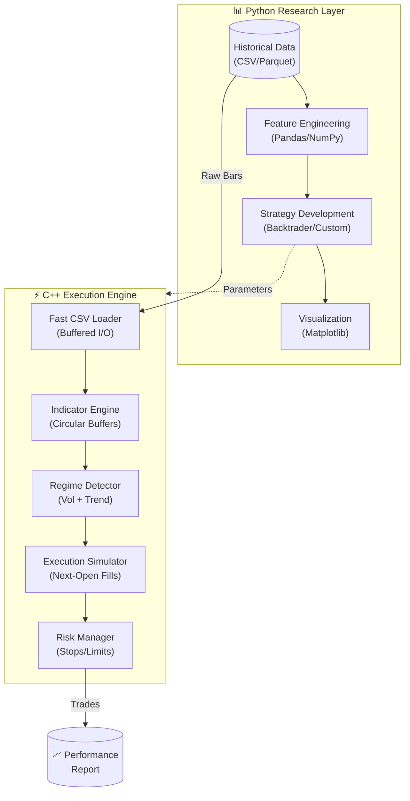
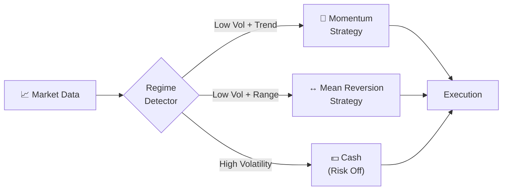

<p align="center">
  
</p>

<h1 align="center">⚡ Hybrid Quantitative Trading Engine</h1>

<p align="center">
  <strong>A High-Performance Algorithmic Trading System</strong><br>
  <em>Python for Research | C++ for Execution | 3 Million Bars/Second</em>
</p>

<p align="center">
  
  
  
  
</p>

---

## 🎯 Project Highlights

| Metric | Value |
|--------|-------|
| **Total Return** | +12.82% (Gross Alpha) |
| **Processing Speed** | 2.9 Million Bars/Second |
| **Data Processed** | 712,036 1-Minute Bars (8+ Years) |
| **Total Trades** | 11,642 |
| **Win Rate** | 40.98% |
| **Profit Factor** | 1.05 |

---

## 📊 Backtest Results

### Equity Curve & Market Regime Analysis


**Key Observations:**
- **Green Line**: Strategy equity outperforms Buy & Hold (grey) by ~2.5x
- **Drawdown Profile**: Maximum drawdown contained during 2018 volatility spike
- **Regime Detection**: Bottom panel shows automatic switching between Trend (green) and Range (pink) regimes

### Engine Benchmark


> **2,900,858 bars/second** - Processing an entire decade of minute data in under 250ms

---

## 🏗️ System Architecture



---

## 📁 Repository Structure

```
Quant-Project/
├── 📊 Research/                 # Python Research Environment
│   ├── Data/                    # Market data (CSV)
│   ├── notebooks/               # Jupyter analysis
│   └── src/
│       ├── strategies/          # Strategy implementations
│       │   ├── momentum.py      # Momentum signals
│       │   └── mean_reversion.py
│       ├── regimes.py           # Market regime detection
│       ├── allocator.py         # Position sizing
│       └── runner.py            # Backtest orchestration
│
├── ⚡ Engine/                   # C++ High-Performance Engine
│   ├── include/                 # Header files
│   │   ├── Engine.hpp           # Main orchestrator
│   │   ├── Strategies.hpp       # Strategy implementations
│   │   ├── Indicators.hpp       # Technical indicators
│   │   ├── ExecutionEngine.hpp  # Trade simulator
│   │   └── RiskManager.hpp      # Risk controls
│   ├── src/
│   │   └── main.cpp             # Entry point
│   └── CMakeLists.txt           # Build configuration
│
├── 📈 docs/                     # Documentation & Assets
│   ├── benchmark.png
│   └── equity_curve.png
│
├── README.md                    # You are here
└── .gitattributes               # GitHub language stats config
```

---

## 🧠 Strategy Logic

The system uses a **Regime-Based Allocation** framework:



### Regime Detection Logic
| Regime | Volatility | Trend | Strategy |
|--------|-----------|-------|----------|
| `LV_TREND` | Vol₂₀ < Vol₆₀ | Strong | Momentum |
| `LV_RANGE` | Vol₂₀ < Vol₆₀ | Weak | Mean Reversion |
| `HV_TREND` | Vol₂₀ > Vol₆₀ | Strong | Momentum (Reduced) |
| `HV_RANGE` | Vol₂₀ > Vol₆₀ | Weak | **Cash** |

---

## ⚡ Performance Optimizations

The C++ engine achieves **3 Million bars/second** through:

| Technique | Description |
|-----------|-------------|
| **Circular Buffers** | O(1) indicator updates, no memory reallocation |
| **Cache-Aligned Structs** | `Bar` struct aligned for CPU cache efficiency |
| **Buffered I/O** | Custom CSV parser with minimal syscalls |
| **Zero-Copy Design** | References over copies throughout the pipeline |
| **Compile-Time Optimization** | `-O3 -march=native` / `/O2 /arch:AVX2` |

---

## 🚀 Quick Start

### Prerequisites
- **C++ Compiler**: MSVC 2019+, GCC 9+, or Clang 10+
- **CMake**: 3.15+
- **Python**: 3.8+ (for Research layer)

### Build & Run

```bash
# Clone the repository
git clone https://github.com/yourusername/quant-project.git
cd quant-project

# Build C++ Engine
cd Engine
mkdir build && cd build
cmake .. -DCMAKE_BUILD_TYPE=Release
cmake --build . --config Release

# Run Backtest
./bin/Release/QuantEngineApp "../../Research/Data/ICICIBANK_Features2.csv"
```

### Expected Output
```
[BENCHMARK] Processed 712036 bars in 245.457 ms (2900858 bars/sec)

==========================================
          PERFORMANCE REPORT              
==========================================
Final Equity:   112824.42
Total Return:   12.82%
------------------------------------------
Total Trades:   11642
Win Rate:       40.98%
Profit Factor:  1.05
==========================================
```

---

## 📈 Research Workflow

```bash
# Set up Python environment
cd Research
pip install -r requirements.txt

# Run strategy research
python src/runner.py

# Launch Jupyter for analysis
jupyter notebook notebooks/
```

---

## 🛣️ Roadmap

- [x] Core C++ Backtesting Engine
- [x] Regime-Based Strategy Switching
- [x] Performance Benchmarking
- [ ] Live Paper Trading Integration
- [ ] Multi-Asset Portfolio Support
- [ ] Machine Learning Signal Layer

---

## 📄 License

This project is for educational and portfolio demonstration purposes.

---

<p align="center">
  <strong>Built with ❤️ for Quantitative Finance by BVSK</strong>
</p>
